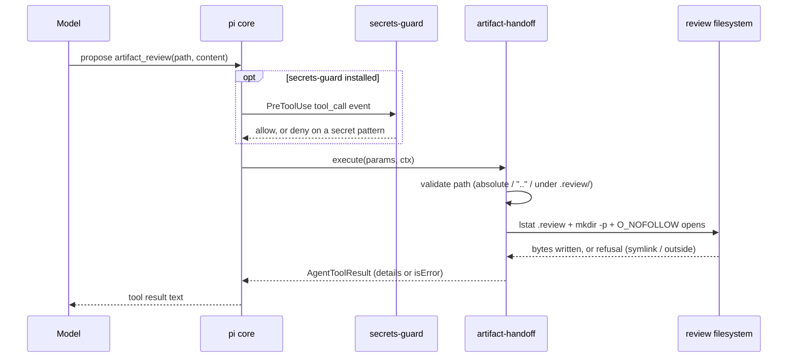
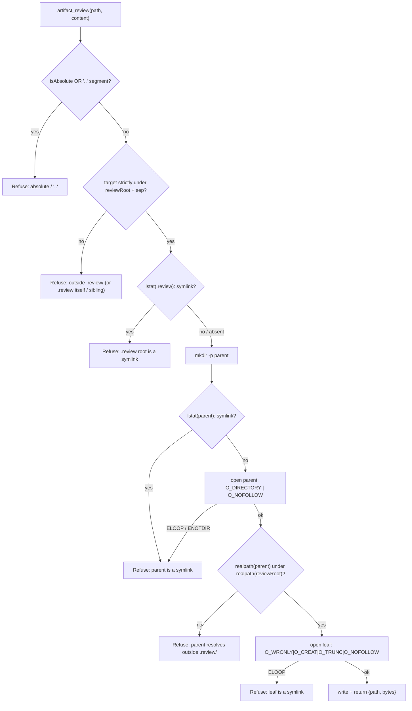
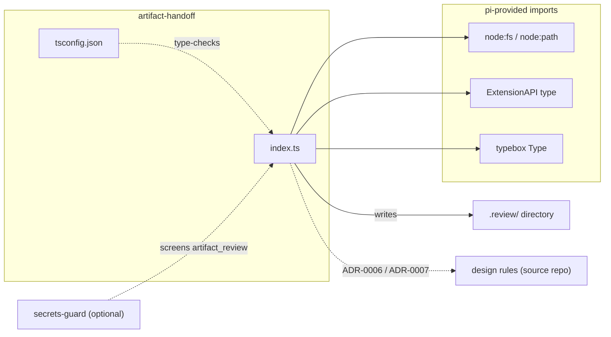

# artifact-handoff

A pi extension that registers the `artifact_review` tool for a review-handoff
workflow: it writes review-artifact payloads under a repo-local `.review/`
directory, with strict path confinement.

- **Source rules:** [ADR-0006](https://github.com/psmfd/pi-config/blob/main/adrs/0006-artifact-handoff-and-review-format.md) § Tooling, [ADR-0007](https://github.com/psmfd/pi-config/blob/main/adrs/0007-tier-3-payload-path.md) § Coupled deliverables
- **Companion infrastructure (in the source distribution):** a tracked `.review/`
  directory, an `artifact-review-guard` CI workflow, `CODEOWNERS`, and the
  github-flow rule's `artifact-review`-labeled-draft-PR carve-out.

## Install

```sh
pi install git:github.com/psmfd/pi-artifact-handoff
```

Try it first without installing: `pi -e git:github.com/psmfd/pi-artifact-handoff`.

## Registered tool

| Name | Purpose |
|---|---|
| `artifact_review` | Write a review-artifact payload under `.review/`. Returns the relative path and byte count on success. |

### Parameters (typebox)

| Field | Type | Required | Description |
|---|---|---|---|
| `path` | string | yes | Path relative to the repo root that must resolve under `.review/`. Absolute paths and `..` segments are refused before resolution. |
| `content` | string | yes | UTF-8 file contents to write. The orchestrator authors the artifact body following [ADR-0006](https://github.com/psmfd/pi-config/blob/main/adrs/0006-artifact-handoff-and-review-format.md) § 1 conventions (`<!-- block:* id=cN -->` / `<!-- review:* id=aN -->` sentinels). |

The handler `mkdir -p`s the parent directory automatically; nested artifact paths
like `.review/issue-99/findings.md` work without a separate prep step.

## How it works

A normal tool call: the handler enforces `.review/` confinement and writes. If the
[secrets-guard](https://github.com/psmfd/pi-secrets-guard) extension is also
installed, it screens the payload at `PreToolUse` before the handler runs.



## Refusal policy (per-rule)

| Rule | Class | Notes |
|---|---|---|
| Absolute path | **hard refusal** | `isAbsolute(rel)` — input must be relative to the repo root |
| `..` segment in input | **hard refusal** | Checked before path resolution; defense-in-depth even though the post-resolution prefix check would also catch most escapes |
| Resolves to `<cwd>/.review/` itself (writing the directory as a file) | **hard refusal** | `target.startsWith(reviewRoot + sep)` requires *strictly under* the directory (also rejects a sibling like `.reviewX/`) |
| Resolves outside `<cwd>/.review/` | **hard refusal** | Same `startsWith(reviewRoot + sep)` check |
| `.review` **root** is itself a symlink | **hard refusal** | `fs.lstat(reviewRoot)` *before* `mkdir -p` — a planted `.review → /evil` symlink cannot be traversed |
| Parent directory is a symlink, or resolves through one outside `<cwd>/.review/` | **hard refusal** | `fs.lstat` on the parent + parent opened `O_DIRECTORY \| O_NOFOLLOW`, then `fs.realpath` re-asserts the prefix — defends against a symlinked root, final, or intermediate component |
| Leaf target is itself a symlink | **hard refusal** | `fs.open` with `O_NOFOLLOW` raises `ELOOP`; caller sees a clean refusal rather than the write redirecting through the link |

All are hard refusals. There is **no override mechanism** for path confinement —
the `.review/` directory *is* the entire point of the tool. Use the built-in
`write` tool for anything else.

**Residual (accepted):** a *concurrent* local writer could swap an intermediate
directory between the `realpath` check and the leaf open. Fully closing that race
needs `openat(2)`-style dir-fd-relative opens, which portable Node's `fs` API does
not expose; it is out of scope for the single-operator local-CLI trust model. The
static symlink vectors (root, intermediate, leaf) are all closed.



## Secrets-guard interaction (in-scope; not a separate refusal)

`artifact_review` is a custom tool, so it does not automatically inherit the
[secrets-guard](https://github.com/psmfd/pi-secrets-guard) extension's
`write`/`edit` coverage. The secrets-guard tool-call handler is explicitly
extended to include `artifact_review` in the same content-scan branch as `write`.
This means PEM private keys, AWS access keys, GitHub PATs, and
vault-named-without-header files are all caught by secrets-guard *before* the
`artifact_review` handler executes.

## Dependency and provenance

Self-contained: no shared modules, no npm dependencies. Only couplings are
pi-provided ambient imports, the `.review/` on-disk contract, and (optionally) a
secrets-guard content screen.



## Testing

`test/index.test.ts` is a `node:test` suite driving the `artifact_review` handler
against **real temp directories and real symlinks**, so the path confinement is
verified rather than asserted in prose — success + nested `mkdir -p`, plus every
hard-refusal rule including the negative symlink cases (symlinked `.review` root,
intermediate directory, and leaf). Run it standalone with:

```sh
node --import tsx --test test/*.test.ts
```

## Override mechanisms

None. See § Refusal policy. To bypass the secrets-guard content scan specifically,
see the [secrets-guard](https://github.com/psmfd/pi-secrets-guard) extension (the
`SKIP_SECRETS_GUARD=1` and `.secrets-guard-allowlist` overrides are session-scoped
and audited).

## File layout

```text
artifact-handoff/
├── index.ts        # Registers the artifact_review tool
├── tsconfig.json   # Per-extension tsc --noEmit config
├── test/           # node:test path-confinement suite (index.test.ts)
└── README.md       # This file
```

No `package.json` (zero npm dependencies). Pi loads `.ts` via jiti; the typebox +
`@earendil-works/pi-coding-agent` types are pi-provided "available imports".

---

> This is the public distribution mirror of the `artifact-handoff` pi extension.
> It is a derived, force-synced artifact — development happens in the upstream
> source repository. Open issues and PRs here; fixes land upstream and sync out.
